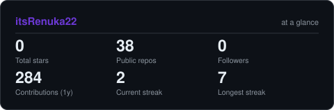
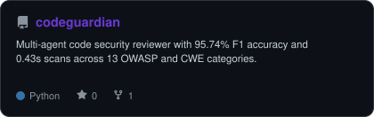
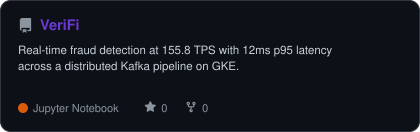
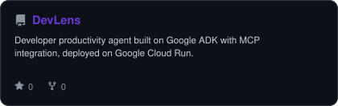
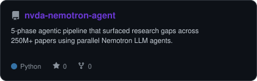

<div align="center">

<!-- NAME / TAGLINE - animated typing -->
<a href="https://github.com/itsRenuka22">
  
</a>

<br>

<!-- SOCIALS -->
<a href="https://www.linkedin.com/in/renuka-patwari/"></a>
<a href="mailto:renukaprasad.patwari@sjsu.edu"></a>
<a href="https://itsrenuka22.github.io/portfolio/"></a>


</div>

---

## `~/` whoami

```console
$ cat about.txt
```

Hi, I'm **Renuka Prasad Patwari**. I build backend and distributed systems, with a growing focus
on applied AI. Right now I'm exploring how agentic systems can catch problems before they reach
production — from security vulnerabilities in code to reliability gaps in engineering workflows.

- Currently building **[DevLens](https://github.com/itsRenuka22/DevLens)**
- Portfolio: **[itsrenuka22.github.io/portfolio](https://itsrenuka22.github.io/portfolio/)**
- Learning **distributed systems design at scale, and going deeper on AI evaluation frameworks and agent reliability**
- Fun fact: **ten years of Bharatanatyam before I ever wrote a line of code**

<br>

<div align="center">

## `~/` toolbox


</div>

---

<div align="center">

## `~/` skill radar

<table>
<tr>
<td width="50%" align="center" valign="middle">

<!-- Self-rated radar - edit assets/skills.json, the workflow redraws it -->
<picture>
  <source media="(prefers-color-scheme: dark)"  srcset="assets/radar-dark.svg">
  <source media="(prefers-color-scheme: light)" srcset="assets/radar-light.svg">
  
</picture>

</td>
<td width="50%" align="center" valign="middle">

<!-- Live radar built from real language byte counts across your repos -->
<picture>
  <source media="(prefers-color-scheme: dark)"  srcset="assets/radar-langs-dark.svg">
  <source media="(prefers-color-scheme: light)" srcset="assets/radar-langs-light.svg">
  
</picture>

</td>
</tr>
</table>

</div>

---

<div align="center">

## `~/` contribution calendar

<!-- 3D isometric calendar, regenerated every 6h by .github/workflows/metrics.yml -->


<br><br>

<!-- Snake eats the contribution graph - .github/workflows/snake.yml -->
<picture>
  <source media="(prefers-color-scheme: dark)"  srcset="https://raw.githubusercontent.com/itsRenuka22/itsRenuka22/output/snake-dark.svg">
  <source media="(prefers-color-scheme: light)" srcset="https://raw.githubusercontent.com/itsRenuka22/itsRenuka22/output/snake.svg">
  
</picture>

</div>

---

<div align="center">

## `~/` the numbers

<!-- Generated by scripts/cards.py into this repo. Deliberately NOT
     github-readme-stats / streak-stats / github-profile-trophy: those are
     shared public instances that go down and take the whole section with them. -->
<picture>
  <source media="(prefers-color-scheme: dark)"  srcset="assets/card-stats-dark.svg">
  <source media="(prefers-color-scheme: light)" srcset="assets/card-stats-light.svg">
  
</picture>

<br>


<br><br>


</div>

---

<div align="center">

## `~/` selected work

<!-- Cards generated by scripts/cards.py from assets/projects.json.
     Stars, forks and language are pulled live from the API on every run. -->
<table>
<tr>
<td width="50%">
  <a href="https://github.com/itsRenuka22/codeguardian">
    <picture>
      <source media="(prefers-color-scheme: dark)"  srcset="assets/card-codeguardian-dark.svg">
      <source media="(prefers-color-scheme: light)" srcset="assets/card-codeguardian-light.svg">
      
    </picture>
  </a>
</td>
<td width="50%">
  <a href="https://github.com/itsRenuka22/VeriFi">
    <picture>
      <source media="(prefers-color-scheme: dark)"  srcset="assets/card-VeriFi-dark.svg">
      <source media="(prefers-color-scheme: light)" srcset="assets/card-VeriFi-light.svg">
      
    </picture>
  </a>
</td>
</tr>
<tr>
<td width="50%">
  <a href="https://github.com/itsRenuka22/DevLens">
    <picture>
      <source media="(prefers-color-scheme: dark)"  srcset="assets/card-DevLens-dark.svg">
      <source media="(prefers-color-scheme: light)" srcset="assets/card-DevLens-light.svg">
      
    </picture>
  </a>
</td>
<td width="50%">
  <a href="https://github.com/itsRenuka22/nvda-nemotron-agent">
    <picture>
      <source media="(prefers-color-scheme: dark)"  srcset="assets/card-nvda-nemotron-agent-dark.svg">
      <source media="(prefers-color-scheme: light)" srcset="assets/card-nvda-nemotron-agent-light.svg">
      
    </picture>
  </a>
</td>
</tr>
</table>

<sub>

| project | stack |
|---|---|
| **[CodeGuardian](https://github.com/itsRenuka22/codeguardian)** | multi-agent security review · OWASP/CWE |
| **[VeriFi](https://github.com/itsRenuka22/VeriFi)** | Kafka · GKE · real-time fraud detection |
| **[DevLens](https://github.com/itsRenuka22/DevLens)** | Google ADK · MCP · Cloud Run |
| **[PaperGap](https://github.com/itsRenuka22/nvda-nemotron-agent)** | Nemotron LLM agents · GTC Hackathon |

</sub>

</div>

---

<div align="center">

<sub>built while listening for the next incident before it happens</sub>

</div>
